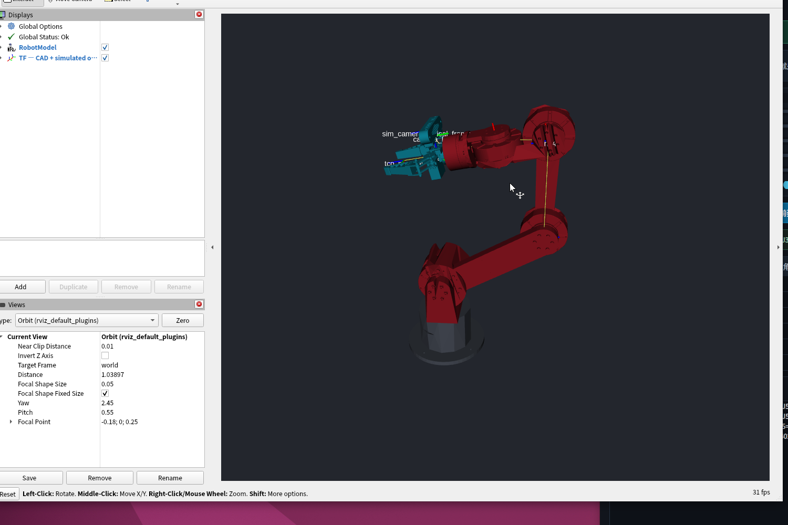
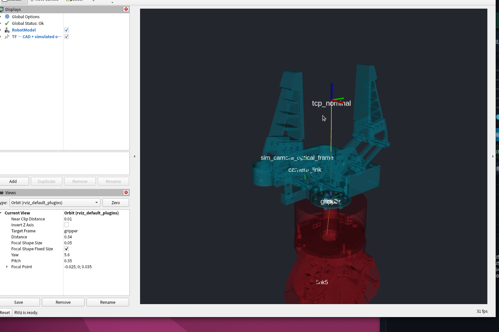
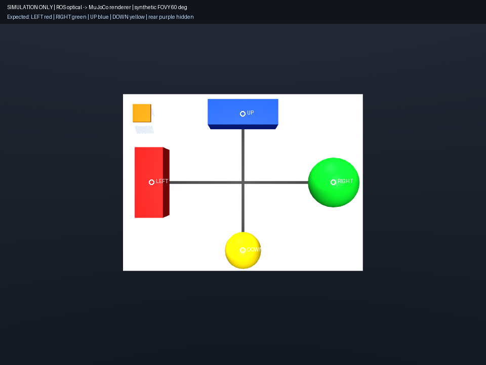

# V15.13 虚拟 Gemini Pro ROS2 / MuJoCo 坐标闭环验收报告

验收结论：**PASS**

本报告只验收纯虚拟坐标链。`sim_camera_optical_frame` 是仿真专用 frame，不声称它是真实 Gemini Pro 驱动的 optical frame；本阶段没有编造 Image、CameraInfo、Depth、PointCloud2 或真实相机内参。

## 1. 最终 TF 树

工程中实际末端 frame 名为 `gripper`，不是 `gripper_link`。未重命名、未增加别名 frame。

```text
world
└── base_link
    └── J1 → link1
        └── J2 → link2
            └── J3 → link3
                └── J4 → link4
                    └── J5 → link5
                        └── J6 → link6
                            └── fixed → gripper
                                ├── fixed → tcp_nominal
                                └── fixed → camera_link
                                    └── fixed → sim_camera_optical_frame
```

MuJoCo renderer `sim_gemini_pro_renderer` 是 `sim_camera_optical_frame` 下的渲染相机，不是 ROS TF frame。

## 2. Frame 原点与轴定义

| Frame | 原点 | 轴定义 |
|---|---|---|
| `world` | CAD / MuJoCo world identity | 已验收的世界坐标 |
| `base_link` | 与 `world` identity 重合 | 既有机械臂根 frame |
| `link1`～`link6` | 已验收的 J1～J6 真实旋转中心 | 子 frame 局部轴为 J1=+Z、J2=+Y、J3=+Y、J4=+Y、J5=+X、J6=+Z；精确 origin/axis 数值未改动 |
| `gripper` | J6 输出/夹爪安装中心 | 既有 gripper 局部轴，未改动 |
| `tcp_nominal` | ClosureAngle=0° 时两侧硅胶有效夹持面面积质心中点 | 继承 `gripper` 轴 |
| `camera_link` | Gemini Pro 源 STEP 作者坐标原点 | +X 沿双镜头基线；+Y 指向外壳后方；+Z 指向安装接触面；观察方向为 -Y |
| `sim_camera_optical_frame` | 双镜头中心中点 | +X 图像右；+Y 图像下；+Z 镜头前方 |
| `sim_gemini_pro_renderer` | 与 optical 原点重合 | MuJoCo +X 右、+Y 上、-Z 观察方向 |

## 3. 冻结 CAD 外参

`T_gripper_camera_link` 未改动：

```text
xyz [m] = [-0.038917046930682, 0.000061006900000, 0.019635428243040]
rpy [rad] = [-1.5707963267948966, 0, -1.5707963267948966]
quaternion [x,y,z,w] = [-0.5, 0.5, -0.5, 0.5]
```

```text
T_gripper_camera_link =
[ 0  0  1  -0.038917046930682 ]
[-1  0  0   0.000061006900000 ]
[ 0 -1  0   0.019635428243040 ]
[ 0  0  0   1                 ]
```

## 4. camera_link → sim_camera_optical_frame

```text
xyz [m] = [0, -0.00905, -0.0128]
rpy [rad] = [pi/2, 0, 0]
quaternion [x,y,z,w] = [0.7071067811865476, 0, 0, 0.7071067811865476]
```

```text
T_camera_link_sim_camera_optical_frame =
[1  0  0   0       ]
[0  0 -1  -0.00905 ]
[0  1  0  -0.0128  ]
[0  0  0   1       ]
```

旋转矩阵的三个列向量是 optical 基向量在 `camera_link` 中的表达：

```text
R * ex = [ 1,  0,  0] = +X_link
R * ey = [ 0,  0,  1] = +Z_link
R * ez = [ 0, -1,  0] = -Y_link
det(R) = +1
```

因此严格得到 `X_opt=+X_link`、`Y_opt=+Z_link`、`Z_opt=-Y_link`；optical +Z 与 CAD 相机观察方向一致。

合成冻结 CAD 外参后，虚拟成像中心在 `gripper` 中的位置为：

```text
[-0.051717046930682, 0.000061006900000, 0.028685428243040] m
```

## 5. ROS optical → MuJoCo renderer camera

MuJoCo 相机使用 +X right、+Y up、-Z viewing direction，所以 renderer 相对 optical 使用 `Rx(pi)`：

```text
T_sim_camera_optical_mujoco_camera =
[1  0  0  0]
[0 -1  0  0]
[0  0 -1  0]
[0  0  0  1]
```

```text
X_mj = +X_opt
Y_mj = -Y_opt
Z_mj = -Z_opt
-Z_mj = +Z_opt  (renderer 观察方向)
+Y_mj = -Y_opt  (renderer 屏幕上方)
det(R) = +1
```

MuJoCo 四元数顺序为 wxyz，该旋转为 `[0, 1, 0, 0]`。

## 6. RViz 模型修复与验收

原 ROS visual STL 来自旧导出路径，嵌套 TopoShape Placement 被重复计算：`link2～link4` 出现 3.4～3.7 m 远端异常三角形，旧 `gripper` 网格只到 Z=46.5 mm，丢失完整手指。J1～J6 的 URDF/MJCF 变换实际一致，因此未调整任何关节参数。

修复后：

- RViz visual 唯一源改为冻结 FCStd 导出、已验收的 MuJoCo `visual_mm` 几何。
- 为 RViz 生成受控 visual-only LOD；逐个断开组件处理，不吞小零件。
- 面数从 7,571,799 降至 1,656,597，全局 AABB 最大偏差 0.312010 mm。
- 夹爪保留全部 238,682 个面，Zmax=119.401787 mm，摄像头与手指完整。
- collision STL、质量、惯量、动力学和 J1～J6 均未改动。

VM 中 RViz `Global Status: OK`，11/11 TF 边完整，唯一根为 `world`，无重复父节点，`/tf_static` 仅由 `robot_state_publisher` 发布。

### RViz 全臂



### RViz 末端坐标轴近景



## 7. MuJoCo 真实渲染方向验收

验收场景使用非对称的左/右、上/下物体和前方标定平面；紫色后方 guard 必须不可见。该场景只在验证器中注入，不进入生产碰撞/动力学模型。

| 标记 | 像素质心 (x,y) | 结果 |
|---|---:|---|
| 左红 | (299.744, 359.500) | 位于右绿左侧 |
| 右绿 | (658.692, 359.500) | PASS |
| 上蓝 | (479.500, 224.314) | 位于下黄上方 |
| 下黄 | (479.500, 493.524) | PASS |
| 前方平面 | 131,051 pixels | 可见 |
| 后方紫 guard | 0 pixels | 不可见 |

未出现左右镜像、上下倒置或前后反转。渲染 FOVY=60° 只是测试用合成参数，不是 Gemini Pro 真实内参。



## 8. 自动化验收结果

| 项目 | 结果 |
|---|---|
| `colcon build --symlink-install` | PASS |
| Xacro 展开 / `check_urdf` | PASS |
| ROS2 TF 运行时链路 | PASS |
| 冻结 `gripper→camera_link` 位置误差 | 0 m |
| 冻结 `gripper→camera_link` 四元数误差 | 1.11e-16 |
| `camera_link→sim_camera_optical_frame` 位置误差 | 0 m |
| `camera_link→sim_camera_optical_frame` 四元数误差 | 1.11e-16 |
| MuJoCo `build_model.py` | PASS |
| 既有 MuJoCo 机械/限位/碰撞/TCP 回归 | PASS |
| 虚拟相机 7 姿态刚体跟随最大位置误差 | 5.55e-17 m |
| 虚拟相机 7 姿态刚体跟随最大旋转误差 | 1.67e-15 |
| MuJoCo 实际渲染方向 | PASS |
| J1～J6 origin/axis/limit | 完全未修改 |

## 9. 机器可读证据

- `QA_ROS2_V15_13_virtual_camera_final_runtime.json`
- `QA_MUJOCO_V15_13_虚拟相机坐标闭环.json`
- `QA_ROS2_V15_13_RVIZ可视网格.json`
- `QA_MUJOCO_V15_13_空载运动学版.json`
